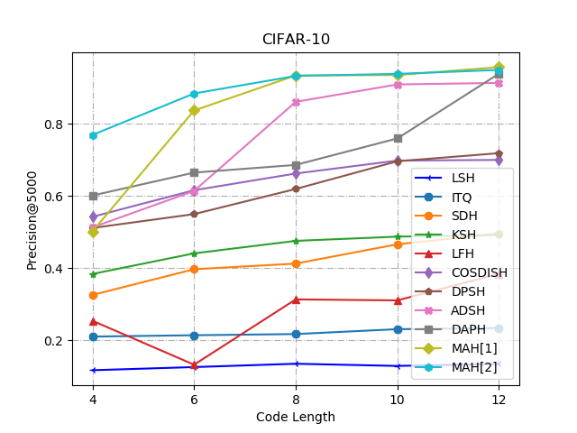
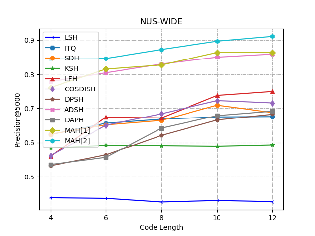
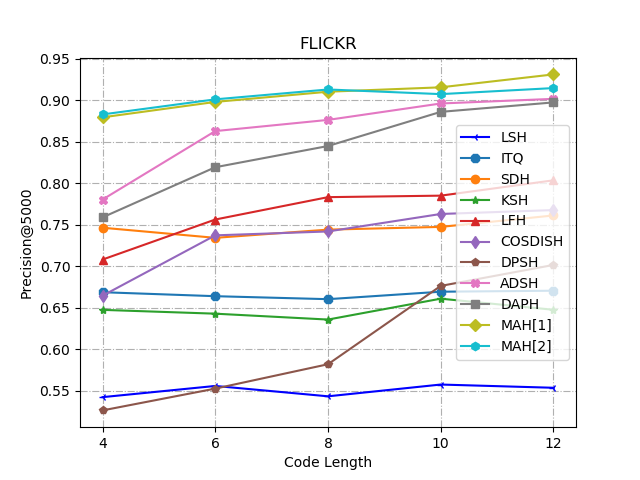

# MAH-Pytorch
PyTorch implementation of our paper "Collaborative Learning for Extremely Low Bit Asymmetric Hashing" [[Link]](https://arxiv.org/abs/1809.09329). 

## Preparation
### Dependencies
- Python 2.7
- PyTorch (version >= 0.4.1)


### Datasets
- CIFAR download the CIFAR-10 Matlab version [[Link]](https://www.cs.toronto.edu/~kriz/cifar.html) then run the script
```shell
matlab ./data/CIFAR-10/SaveFig.m
```
- NUSWIDE dataset
- MIRFlickr dataset

([referenced repo](https://github.com/jiangqy/DPSH-pytorch))


## Results

### Mean Average Precision on CIFAR-10.
<table>
    <tr>
        <td rowspan="2">Method</td><td rowspan="2">Backbone</td>    
        <td colspan="5">Code Length</td>
    </tr>
    <tr>
        <td >4 bits</td> <td >6 bits</td> <td >8 bits</td> <td >10 bits</td><td >12 bits</td>  
    </tr>
    <tr>
        <td >MAH-flat</td><td >ResNet50</td ><td > 0.4759</td> <td > 0.8197 </td><td > 0.9339 </td> <td > 0.9335 </td> <td > 0.9503</td>
    </tr>
    <tr>
        <td >MAH-cascade</td><td >ResNet50</td ><td > 0.7460 </td> <td > 0.8950 </td><td > 0.9429 </td> <td > 0.9489 </td> <td > 0.9537 </td>
    </tr>
</table>


### Precision@5K Figures


## Usage
For traning with the cascaded multihead structure on different datasets:
```shell
python cascade_CIFAR-10.py --bits '4' --gpu '1' --batch-size 64
python cascade_FLICKR.py --bits '4' --gpu '1' --batch-size 64
python cascade_NUS_WIDE.py --bits '4' --gpu '1' --batch-size 64
```

For traning with the flat multihead structure on different datasets:
```shell
python flat_CIFAR-10.py --bits '4' --gpu '1' --batch-size 64
python flat_FLICKR.py --bits '4' --gpu '1' --batch-size 64
python flat_NUS_WIDE.py --bits '4' --gpu '1' --batch-size 64
```
## Citation
Please cite the following paper in your publications if it helps your research:
    
    @article{DBLP:journals/corr/abs-1809-09329,
        author    = {Yadan Luo and
                     Yang Li and
                     Fumin Shen and
                     Yang Yang and
                     Peng Cui and
                     Zi Huang},
        title     = {Collaborative Learning for Extremely Low Bit Asymmetric Hashing},
        journal   = {CoRR},
        volume    = {abs/1809.09329},
        year      = {2018},
        url       = {http://arxiv.org/abs/1809.09329},
        archivePrefix = {arXiv},
        eprint    = {1809.09329},
        timestamp = {Wed, 13 Mar 2019 15:40:02 +0100},
        biburl    = {https://dblp.org/rec/bib/journals/corr/abs-1809-09329},
        bibsource = {dblp computer science bibliography, https://dblp.org}
      }
